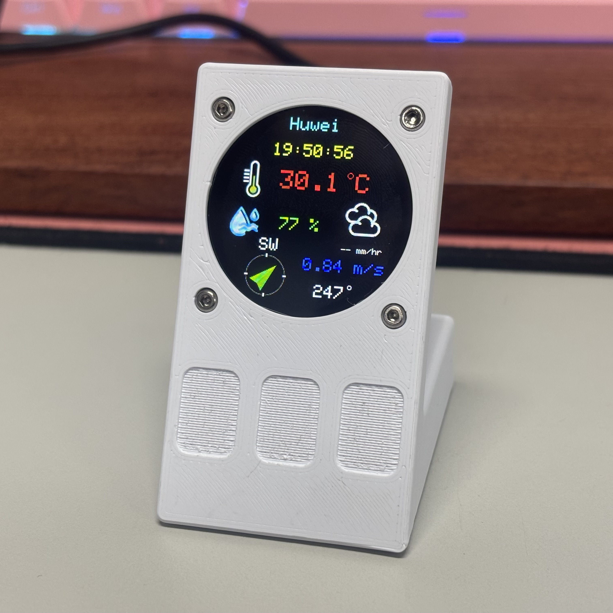
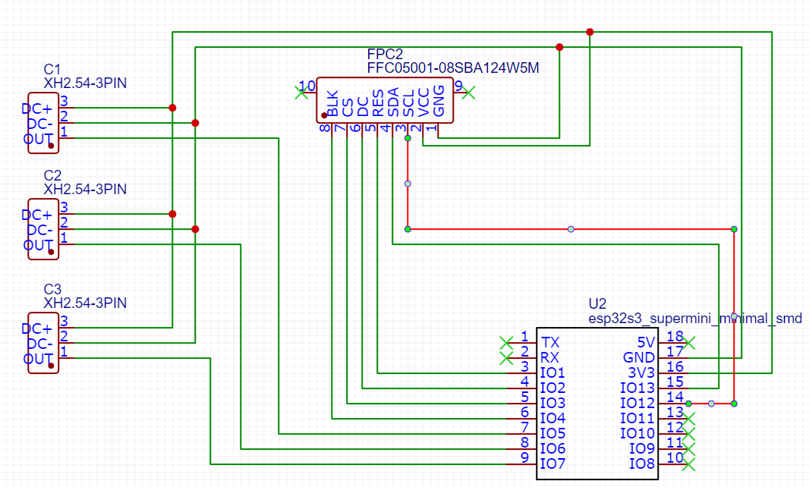
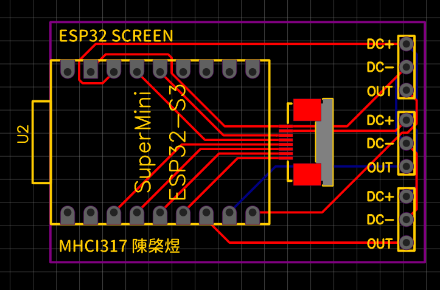
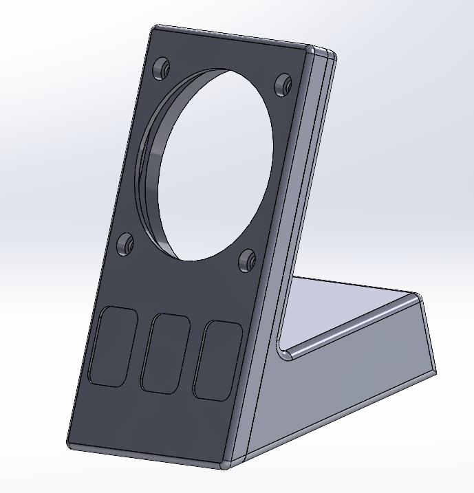

# ESP32-Screen

This is a desktop project using an ESP32 and a small circular display. It features three default pages: a clock, a weather display, and a PC status monitor via AIDA64.



**Demo:**

<!-- [](https://youtu.be/fua61k692V0) -->

---

## Hardware

* **ESP32 S3 Super Mini**
* **GC9A01 1.28" SPI LCD**
* **3 Touch Buttons**
* **8-pin Flexible Flat Cable (FFC) / Connector**
* **Custom PCB Board**
* **4 Sets of M2 Screws and Nuts**
* **3D-Printed Enclosure (Designed in SolidWorks)**

---

## EasyEDA

The hardware design files are available in the EasyEDA project:

* **Schematic Diagram**


<!--  -->

* **PCB Layout**

<!--  -->


---

## Enclosure

The enclosure is designed in SolidWorks and 3D printed. Both the SolidWorks source file and STL file are provided in the `Enclosure` [folder](Enclosure).



---

## Arduino

### Project Structure

```
esp32_screen/
├── esp32_screen.ino (Main source code)
├── Config.h
├── Display.h
├── Display.cpp
├── Clock.h
├── Clock.cpp
├── Weather.h
├── Weather.cpp
├── Monitor.h
├── Monitor.cpp
└── data/ (Assets for LittleFS upload)
```

### Board Manager

- Install **ESP32** board support via the Board Manager.
- Recommended version: **2.0.14**

### LittleFS Setup

* Use the provided VSIX extension: `arduino-littlefs-upload-1.5.4.vsix` [file](/Arduino/arduino-littlefs-upload-1.5.4.vsix)
* For full installation and usage guide, please refer to: [Arduino IDE 2: Install ESP32 LittleFS Uploader (Upload Files to the Filesystem)](https://randomnerdtutorials.com/arduino-ide-2-install-esp32-littlefs/)

### TFT SPI Setup

* A custom `User_Setup.h` [file](Arduino/User_Setup.h) is provided.
* Replace the original file in the `TFT_eSPI` library folder (typically located at `Documents/Arduino/libraries/TFT_eSPI/`).

| SPI pins  | GPIO  |
| --------  | ----  |
| TFT_MOSI  | 13    |
| TFT_SCLK  | 12    |
| TFT_CS    | 3     |
| TFT_DC    | 2     |
| TFT_RST   | 1     |
| TFT_BL    | 4     |

### WiFi Setup

Update your WiFi credentials and AIDA64 host IP:

```
const char* ssid = "your_wifi_ssid";
const char* password = "your_wifi_password";
const char* host = "your_AIDA64_PC_ip";
```

### Time Zone Setup

Time is synchronized via NTP:

```
NTPClient timeClient(ntpUDP, "pool.ntp.org", 28800, 60000); // UTC+8 (Taiwan timezone), updates every 60 seconds
```

### OpenWeather API Key

Add your API key from OpenWeather:

```
const char* apiKey = "your_openweather_api_key";
```

### City Setup

Specify your location for weather data:

```cpp
const char* city = "Taipei,TW";
```

---

## AIDA64

Install the provided `rslcd` configuration file on your PC to enable PC monitoring over WiFi.

---

## License

This project is released under the [MIT License](LICENSE). Feel free to use and modify it.